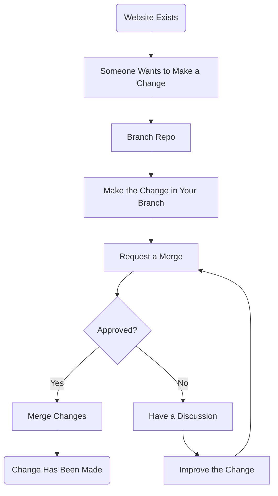

## The Change Process

```mermaid
graph TD
    st(Website Exists) --> op1[Someone Wants to Make a Change]
    op1 --> sub1[Branch Repo]
    sub1 --> op2[Make the Change in Your Branch]
    op2 --> sub2[Request a Merge]
    sub2 --> cond{Approved?}
    cond -- Yes --> io[Merge Changes]
    cond -- No --> op3[Have a Discussion]
    op3 --> op4[Improve the Change]
    op4 --> sub2
    io --> e(Change Has Been Made)
```