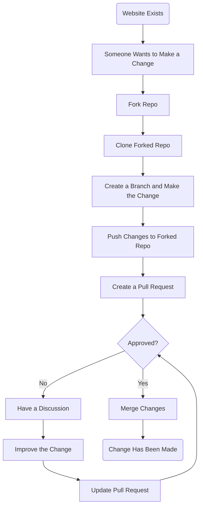

## The Change Process

```mermaid
graph TD
    st(Website Exists) --> op1[Someone Wants to Make a Change]
    op1 --> sub1[Fork Repo]
    sub1 --> sub2[Clone Forked Repo]
    sub2 --> op2[Create a Branch and Make the Change]
    op2 --> sub3[Push Changes to Forked Repo]
    sub3 --> sub4[Create a Pull Request]
    sub4 --> cond{Approved?}
    cond -- Yes --> io[Merge Changes]
    cond -- No --> op3[Have a Discussion]
    op3 --> op4[Improve the Change]
    op4 --> sub5[Update Pull Request]
    sub5 --> cond
    io --> e(Change Has Been Made)
```