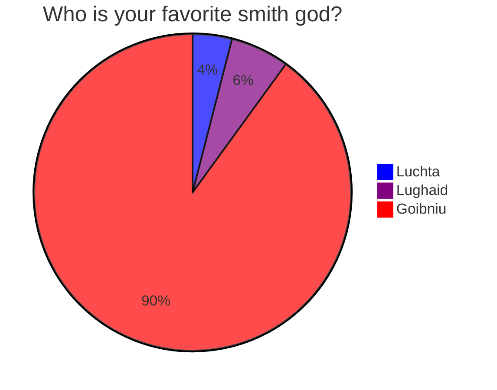
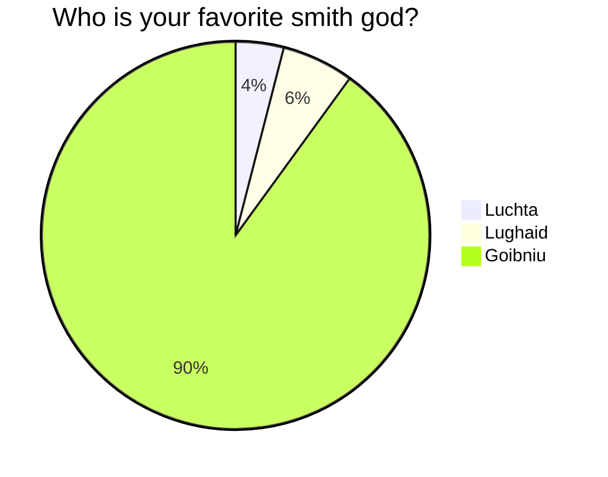

## Flowcharts & Pie Graphs

```flow
sequenceDiagram
    Alice->>John: Hello John, how are you?
    John-->>Alice: Great!
    Alice-)John: See you later!
```

````md
```flow
sequenceDiagram
    Alice->>John: Hello John, how are you?
    John-->>Alice: Great!
    Alice-)John: See you later!
```
````
Go [here](https://github.com/adrai/flowchart.js) reference to master this type of formatting.

# Who is your favorite Smith God?


````md

````