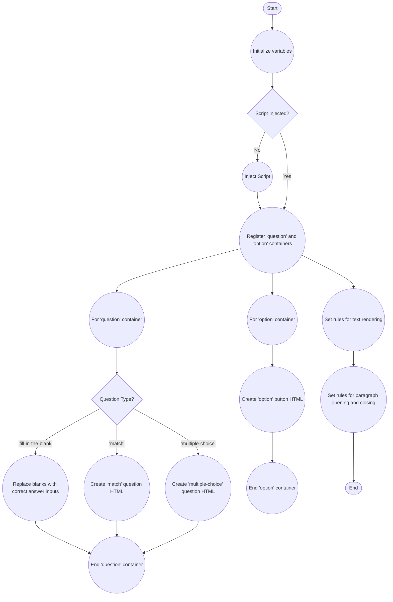
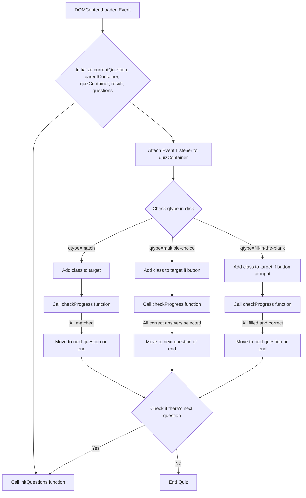

```mermaid
graph TD
A([Start]) --> B((Initialize variables))
B --> C{Script Injected?}
C -- No --> D((Inject Script))
D --> E((Register 'question' and 'option' containers))
C -- Yes --> E
E --> F((For 'question' container))
F --> G{Question Type?}
G -- 'fill-in-the-blank' --> H((Replace blanks with correct answer inputs))
G -- 'match' --> I((Create 'match' question HTML))
G -- 'multiple-choice' --> J((Create 'multiple-choice' question HTML))
H --> K((End 'question' container))
I --> K
J --> K
E --> L((For 'option' container))
L --> M((Create 'option' button HTML))
M --> N((End 'option' container))
E --> O((Set rules for text rendering))
O --> P((Set rules for paragraph opening and closing))
P --> Q([End])
```

```mermaid
flowchart TD
  A[DOMContentLoaded Event]
  B{Initialize currentQuestion, parentContainer, quizContainer, result, questions}
  C[Call initQuestions function]
  D[Attach Event Listener to quizContainer]
  E{Check qtype in click}
  F1[Add class to target]
  F2[Add class to target if button]
  F3[Add class to target if button or input]
  G1[Call checkProgress function]
  G2[Call checkProgress function]
  G3[Call checkProgress function]
  H1[Move to next question or end]
  H2[Move to next question or end]
  H3[Move to next question or end]
  I{Check if there's next question}
  J[End Quiz]

  A --> B
  B --> C
  B --> D
  D --> E
  E -- qtype=match --> F1
  E -- qtype=multiple-choice --> F2
  E -- qtype=fill-in-the-blank --> F3
  F1 --> G1
  F2 --> G2
  F3 --> G3
  G1 -- All matched --> H1
  G2 -- All correct answers selected --> H2
  G3 -- All filled and correct --> H3
  H1 --> I
  H2 --> I
  H3 --> I
  I -- Yes --> C
  I -- No --> J
```

